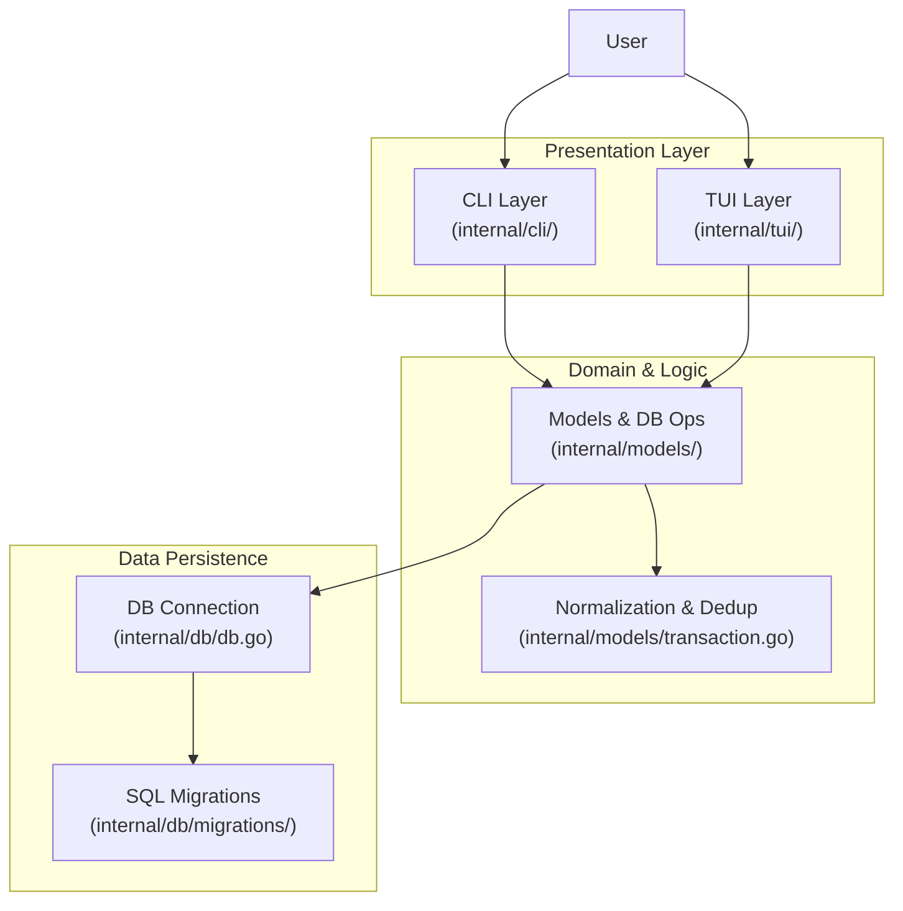

# System Architecture - Personal Finance CLI

## 1. Overview
The Personal Finance CLI Manager is a local-first application designed to track personal finances via the terminal. It follows a **Layered Architecture**, separating the presentation (CLI commands & TUI) from the business logic and data storage.

**Key Goals:**
* **Zero-dependency setup:** Uses a pure Go SQLite driver (`modernc.org/sqlite`).
* **Extensibility:** Command logic is decoupled from database implementation.
* **Usability:** Provides both a command-based interface for scripting and an interactive TUI for browsing.

## 2. Technology Stack
* **Language:** Go (Golang) 1.21+
* **CLI Framework:** `spf13/cobra` (Command routing and flags)
* **Database:** SQLite (Embedded relational DB)
* **TUI Library:** `rivo/tview` (Terminal user interface)
* **Text Processing:** `golang.org/x/text` (Category normalization)

## 3. High-Level Architecture

The system is organized into three main layers, mapped directly to the source code structure:

### 3.1 Component Mapping
* **`internal/cli/`**: **Presentation Layer**. Contains handlers for `import`, `add`, `budget`, etc. It parses flags, formats output (ASCII charts), and calls the Model layer.
* **`internal/tui/`**: **Interactive Layer**. Manages the `tview` application, table rendering, and keyboard events.
* **`internal/models/`**: **Domain Layer**. Contains structs (`Transaction`, `Budget`) and business logic.
    * **`transaction.go`**: Handles deduplication (`TransactionExists`) and normalization (`NormalizeCategory`).
* **`internal/db/`**: **Infrastructure**. Handles SQLite connection setup (`db.go`).
* **`internal/db/migrations/`**: **Schema**. SQL files that are automatically applied on startup to create tables.

## 4. Key Components

### 4.1 CLI Commands (`internal/cli`)
* **Root (`root.go`):** Sets up global flags and database connection.
* **Import (`import.go`):** Parses CSV/OFX files, handles deduplication and auto-categorization.
* **Report (`report.go`):** Aggregates SQL data and renders ASCII bar charts.
* **Budget (`budget.go`):** CRUD logic for budget limits and alert checking.
* **Rules (`rules.go`):** Manages regex patterns for auto-categorization.

### 4.2 Data Models (`internal/models`)
* **Transaction (`transaction.go`):** Core entity. Includes logic for `TransactionExists` (deduplication) and `NormalizeCategory`.
* **CategoryRule (`category_rule.go`):** Regex patterns for auto-assigning categories during import.
* **Budget (`budget.go`):** Monthly limits per category.
* **Report (`report.go`):** Helper functions to aggregate spending data (`GetMonthlyReport`).

### 4.3 Database Schema
The SQLite database consists of three main tables (defined in `migrations/`):
1.  **`transactions`**: Stores date, amount, description, and normalized category.
2.  **`budgets`**: Stores spending limits for specific categories.
3.  **`category_rules`**: Stores regex patterns mapping descriptions to categories.

## 5. Critical Data Flows

### 5.1 Import Process
1.  **Read:** CLI opens `.csv` or `.ofx` file.
2.  **Parse:** Raw data is converted into struct fields.
3.  **Auto-Categorize:** Description is matched against `category_rules` (Regex).
4.  **Normalize:** Category string is converted to Title Case (e.g., "food" -> "Food").
5.  **Deduplicate:** System checks `TransactionExists` (using Date + Description + Epsilon Amount check).
6.  **Persist:** If unique, data is inserted into SQLite.

### 5.2 Budget Alerting
1.  **Trigger:** User runs `finance add` or `import`.
2.  **Calculation:** System calculates total spending for the category in the current month.
3.  **Comparison:** Total spent is compared against the `budget` limit.
4.  **Feedback:** If spent > limit, a warning is printed to `stdout` immediately.

### 5.3 Category Normalization
To ensure consistency across reports and budgets, all inputs pass through a normalization pipeline:
* User Input (`"groceries"`) -> `cases.Title` -> Normalized (`"Groceries"`) -> Database.